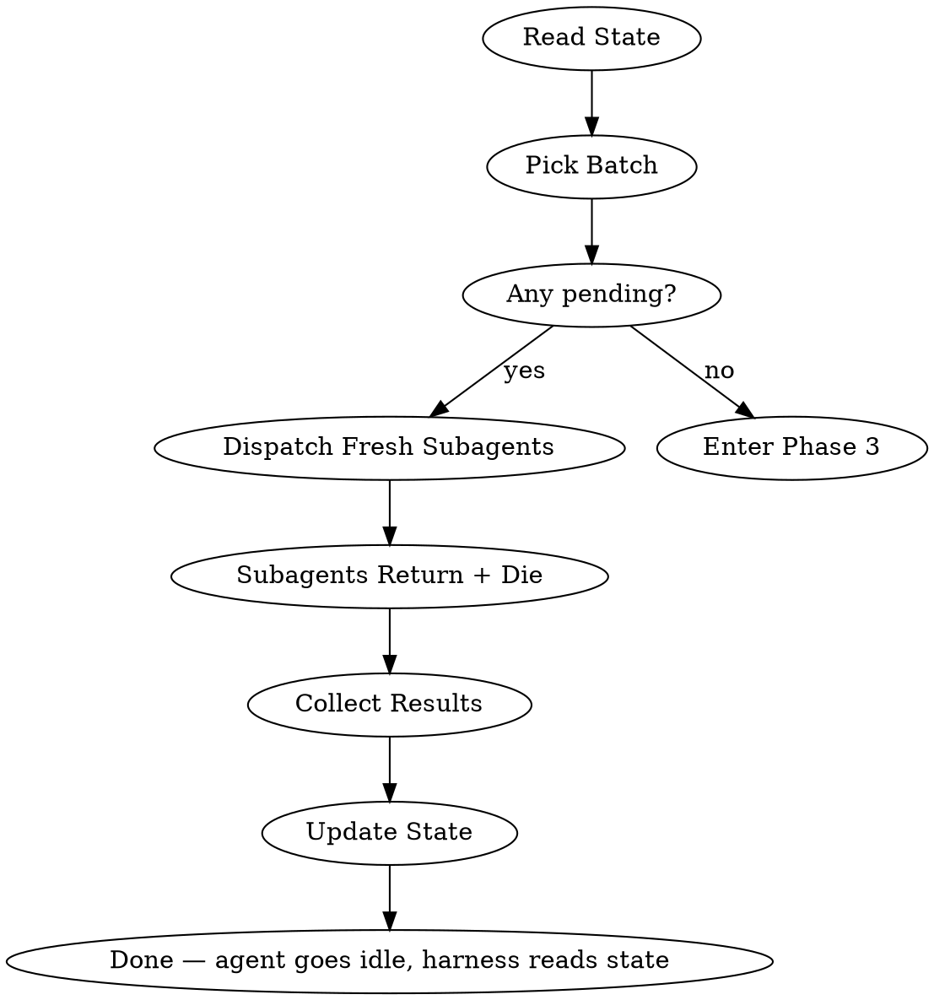
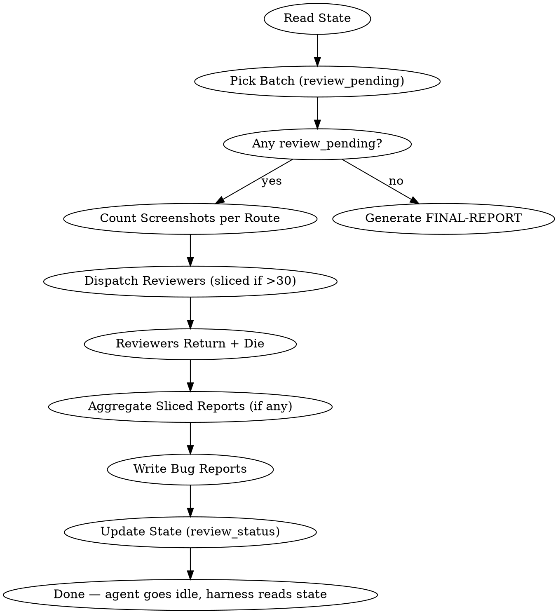

# Agent Test — Autonomous UI Coverage

## Overview

Autonomously agent-test every route in a web application. Dispatches one subagent per route, each performing DFS click-all testing (the "maze algorithm"), producing screenshots and structured reports. Uses the **Ralph Loop** harness pattern for unattended autonomous execution — the user starts the test and walks away.

**Project-agnostic.** Works with any SPA or MPA.

## Architecture

```
┌──────────────────────────────────────────────────────────────────┐
│                       Ralph Loop Harness                          │
│    (external iteration — agent never controls its own loop)       │
├──────────────────────────────────────────────────────────────────┤
│                                                                    │
│  Phase 1: Setup                                                    │
│  ┌──────────────┐   ┌───────────────┐   ┌──────────────────┐     │
│  │ Route        │──▶│ State         │──▶│ Route Selection  │     │
│  │ Discovery    │   │ Initialize    │   │ (ask user)       │     │
│  └──────────────┘   └───────────────┘   └──────────────────┘     │
│                                                                    │
│  Phase 2: Test Execution (Ralph Loop — batched)                    │
│  ┌──────────────────────────────────────────────────────────┐     │
│  │  Pick batch → Dispatch N fresh subagents in parallel      │     │
│  │                                                            │     │
│  │  ┌──────────┐  ┌──────────┐  ┌──────────┐               │     │
│  │  │ Subagent │  │ Subagent │  │ Subagent │  (each is a   │     │
│  │  │ Route A  │  │ Route B  │  │ Route C  │  NEW Task —   │     │
│  │  │ (born)   │  │ (born)   │  │ (born)   │  never reused)│     │
│  │  └────┬─────┘  └────┬─────┘  └────┬─────┘               │     │
│  │       │ done         │ done        │ done                 │     │
│  │       ▼ (dies)       ▼ (dies)      ▼ (dies)               │     │
│  │  Collect results → Update state                            │     │
│  │  More pending? → next batch   |   0 pending? → Phase 3    │     │
│  └──────────────────────────────────────────────────────────┘     │
│                                                                    │
│  Phase 3: Bug Report Review (Ralph Loop — batched)                 │
│  ┌──────────────────────────────────────────────────────────┐     │
│  │  Pick batch → Dispatch N fresh REVIEW subagents           │     │
│  │                                                            │     │
│  │  ┌──────────┐  ┌──────────┐  ┌──────────┐               │     │
│  │  │ Reviewer │  │ Reviewer │  │ Reviewer │  (each is a   │     │
│  │  │ Route A  │  │ Route B  │  │ Route C  │  NEW Task —   │     │
│  │  │ (born)   │  │ (born)   │  │ (born)   │  never reused)│     │
│  │  └────┬─────┘  └────┬─────┘  └────┬─────┘               │     │
│  │       │ done         │ done        │ done                 │     │
│  │       ▼ (dies)       ▼ (dies)      ▼ (dies)               │     │
│  │  Collect bug reports → Update state                        │     │
│  │  More review_pending? → next batch  |  0 pending? → Phase 4│     │
│  └──────────────────────────────────────────────────────────┘     │
│                                                                    │
│  Phase 4: Final Summary                                            │
│  ┌──────────────────────────────────────────────────────────┐     │
│  │  Read all per-route bug reports → Generate FINAL-REPORT   │     │
│  │  → Agent goes idle → Harness detects FINAL-REPORT.md      │     │
│  └──────────────────────────────────────────────────────────┘     │
│                                                                    │
└──────────────────────────────────────────────────────────────────┘
```

## Subagent Lifecycle — CRITICAL

**Every subagent is ephemeral.** This applies to BOTH testing subagents AND review subagents.

| Rule | Rationale |
|------|-----------|
| **One fresh Task call per sub-route** | Each route gets a brand-new subagent. The Task tool creates a fresh context automatically. |
| **Subagent terminates after returning its result** | Once a subagent returns its report (JSON for testing, Markdown for review), it dies. The orchestrator collects the result. |
| **NEVER reuse a subagent for multiple routes** | Reusing a subagent means accumulated context → hallucination risk, context overflow, and stale browser state. |
| **NEVER pass `task_id` to continue a previous subagent** | Each dispatch is a clean `Task()` call without `task_id`. No session continuation. |
| **Browser sessions are per-subagent** | Each testing subagent runs `agent-browser open --headless <url>` and `agent-browser close` within its own lifetime. Review subagents don't need browsers. |

**The lifecycle is: born → do one job → return result → die.** No exceptions.

## Ralph Loop Integration

The Ralph Loop is a **harness pattern** — the agent does not loop itself. An external plugin (Claude Code hook or OpenCode plugin) detects when the agent goes idle, reads the state file to determine if work remains, and re-invokes the agent with a continuation prompt.

### How It Works Here

1. **The agent runs one iteration** — picks a batch of pending routes, dispatches subagents, collects results, updates state file
2. **The agent finishes and goes idle** — no special output required
3. **The harness reads `.monkey-test-state.json`** and decides:
   - `pending > 0` → inject continuation prompt for testing phase
   - `pending == 0, review_pending > 0` → inject continuation prompt for review phase
   - `pending == 0, review_pending == 0, no FINAL-REPORT.md` → inject prompt to generate final report
   - `FINAL-REPORT.md exists` → DONE, let the agent stop

### State-File-Driven Completion Detection

The harness **never** relies on agent output to determine loop state. The `.monkey-test-state.json` file is the single source of truth. Phase detection logic:

| Condition | Phase | Harness Action |
|-----------|-------|---------------|
| `meta.pending > 0` | Testing | Inject testing continuation prompt |
| `meta.pending == 0 && meta.review_pending > 0` | Review | Inject review continuation prompt |
| `meta.pending == 0 && meta.review_pending == 0 && no FINAL-REPORT.md` | Final Report | Inject final report prompt |
| `FINAL-REPORT.md exists` | Done | Allow agent to stop |

This means the agent does NOT need to emit `<promise>` tags. The harness handles everything externally. The agent just needs to update the state file correctly after each batch.

### Harness Implementations

The Ralph Loop harness is NOT part of this skill's code. It lives in the **host environment**:

- **Claude Code**: `plugins/claude-code/scripts/ralph-loop.sh` — a Stop hook that intercepts agent idle
- **OpenCode**: `plugins/opencode/index.ts` — a plugin that listens for `session.idle` events

Install the appropriate plugin for your platform. See the plugin READMEs for details.

### Responsibility Split

| Responsibility | Agent | Harness |
|---------------|-------|---------|
| Pick batch from pending | Yes | No |
| Dispatch subagents | Yes | No |
| Update state file | Yes | No |
| Read state file for phase detection | No | Yes |
| Inject continuation prompt | No | Yes |
| Enforce max iterations | No | Yes |
| Track iteration count | No | Yes |
| Stall detection | No | Yes |
| Context management (session restart) | No | Yes |

The harness is a thin external loop. The agent does all the real work.

### Anti-Dead-Loop Guarantees

The Ralph Loop is NOT a `while(true)` inside the agent. Safeguards:

1. **Agent terminates after each batch** — it goes idle and the harness decides
2. **Harness controls re-invocation** — agent cannot force another iteration
3. **Max iterations** — harness enforces a configurable limit (default: 100)
4. **State file is source of truth** — if state shows 0 pending and 0 review_pending and FINAL-REPORT.md exists, the loop ends
5. **Stall detection** — if the state file is unchanged for 3 consecutive iterations, the harness stops the loop
6. **Per-session limit** — harness restarts with a fresh context after N iterations (default: 10) to prevent context overflow
7. **Each iteration is independently valid** — crash mid-iteration leaves routes in "pending" (safe retry)

## Workflow

### Phase 1: Setup (One-Time)


1. **Route Discovery** — Use `agent-test:route-discovery` skill
   - Scan code (Strategy A) or explore browser (Strategy B) or accept user-provided list (Strategy C)
   - Output: `ROUTE_MAP.md` at project root

2. **Route Selection** — Present the route map to the user and ask for test scope.

   **MANDATORY: You MUST ask the user before proceeding to test execution.** Do NOT assume "test everything". Present the ROUTE_MAP.md summary and ask:

   ```
   Route discovery complete. Found {N} testable routes across {M} categories.

   How would you like to proceed?

   1. Full test — Test all {N} routes (estimated: ~{N/batch_size} iterations)
   2. Select main categories — Choose which top-level sections to test
      (e.g., "Settings", "Products", "Users", ...)
   3. Select specific routes — Pick individual sub-routes to test
      (e.g., /settings/general, /products/inventory, ...)
   ```

   Based on the user's response:

   | Choice | Action |
   |--------|--------|
   | **Full test** | All routes from ROUTE_MAP.md go into pending |
   | **Main categories** | Show category list with route counts. User selects categories. Only routes under selected categories go into pending. |
   | **Specific routes** | Show full route list. User selects individual routes. Only selected routes go into pending. |

   **Category presentation format:**
   ```
   Categories found in ROUTE_MAP.md:

    [ ] Settings (8 routes): /settings/general, /settings/billing, ...
    [ ] Products (10 routes): /products/inventory, /products/catalog, ...
    [ ] Analytics (14 routes): /analytics/traffic, ...
    [ ] Users (14 routes): /users/roles, ...
   [ ] Settings (20 routes): /settings/account-information, ...
   ...

   Which categories? (comma-separated numbers, or "all")
   ```

   **Specific route presentation format:**
   ```
    Routes under "Settings":
      1. /settings/general
      2. /settings/billing
      3. /settings/team
      ...

    Routes under "Products":
      4. /products/inventory
      5. /products/catalog
     ...

   Which routes? (comma-separated numbers, ranges like "1-5", or "all")
   ```

   **Re-testing support:** If `.monkey-test-state.json` already exists (resuming a previous session), also offer:
   ```
   4. Resume — Continue testing {P} remaining pending routes
   5. Re-test failed — Re-test the {F} routes that failed previously
   6. Re-test specific — Pick routes to re-test (moves them back to pending)
   ```

3. **Initialize State** — Use `agent-test:state-management` skill
   - Create `.monkey-test-state.json` with ONLY the selected routes as "pending"
   - Create output directories: `monkey-test-screenshots/`, `monkey-test-reports/`
   - If resuming: load existing state, do not overwrite completed results

4. **Collect Configuration** — User provides:
   - `base_url`: Application URL (e.g., `http://localhost:3000`)
   - `credentials`: Login username/password (if auth required)
   - `batch_size`: Routes per iteration (default: 3)
   - `safe_to_mutate`: Whether destructive actions are allowed (default: false)

### Phase 2: Test Execution (Ralph Loop)

Each iteration of the loop:



1. **Read state** — Load `.monkey-test-state.json`
2. **Check pending** — If none, proceed to Phase 3
3. **Pick batch** — Select next N routes from pending (default N=3)
4. **Dispatch fresh subagents** — One NEW Task per route, using the page-tester-agent prompt template
   - Each subagent gets: route, base_url, credentials, screenshots_dir, safe_to_mutate flag
   - Subagents run in parallel (independent browser sessions)
   - **Each subagent is a fresh Task call — no `task_id` reuse**
5. **Subagents return and die** — Each returns its report JSON and terminates. The orchestrator collects results.
6. **Write reports** — Save each report to `monkey-test-reports/{route_slug}.json`
7. **Cleanup orphaned browsers** — After collecting all results, kill any leaked `agent-browser` processes from crashed subagents:
   ```bash
   # Kill any orphaned agent-browser processes (subagents that crashed without closing)
   pkill -f 'agent-browser' 2>/dev/null || true
   # Also clean up orphaned Chrome processes spawned by agent-browser
   pkill -f 'chrome.*--headless' 2>/dev/null || true
   # Clean up temp directories
   rm -rf /tmp/agent-browser-chrome-* 2>/dev/null || true
   ```
   This is a **safety net** — well-behaved subagents close their own browsers. But crashed subagents may leave orphans.
8. **Update state** — Move routes from pending to completed/failed, update counters
9. **Go idle** — The harness reads the state file and decides whether to continue or transition to Phase 3

### Phase 3: Bug Report Review (Ralph Loop)

After all testing is complete (0 pending routes), the orchestrator enters the review phase. This phase dispatches **review subagents** to examine screenshots and test reports for each sub-route, producing per-route bug analysis reports.

**Same Ralph Loop contract** — the review phase uses the same state-file-driven approach. The harness detects `review_pending > 0` and injects review continuation prompts.

#### Screenshot Batch-Slicing

A single route may produce 50+ screenshots, which can overflow a review subagent's context. The orchestrator applies **batch-slicing** based on screenshot count:

| Screenshots per Route | Strategy |
|----------------------|----------|
| <= 30 | **Full review** — 1 reviewer examines all screenshots. `SLICE_INDEX=1, TOTAL_SLICES=1, SCREENSHOT_FILES=ALL` |
| > 30 | **Sliced review** — Split into slices of ~25 screenshots each. N reviewers per route, each gets a specific file list. |

**Slicing rules:**
1. Sort screenshots by filename (they are numbered in execution order)
2. Split into slices of ~25 files each. Prefer phase-aligned boundaries (split between `02-*` and `03-*` rather than mid-sequence), but don't agonize — approximate alignment is fine.
3. Each slice-reviewer gets: the full report JSON (for context) + its specific screenshot file list.
4. Slice-reviewers produce **partial** bug reports with slice-scoped bug IDs.
5. Orchestrator **aggregates** partial reports into the final per-route bug report:
   - Merge all bugs, renumber IDs (drop the `S{N}` prefix)
   - Deduplicate bugs that appear in overlapping context
   - Combine notes sections
   - Write unified `{route_slug}-bugs.md`

#### Aggregation

When a route was sliced, the orchestrator (NOT a subagent) aggregates after all slices return:

1. Read all partial reports for the route
2. Merge bugs: collect all bugs from all slices, renumber sequentially (`C1, C2, M1, M2, m1...`)
3. If multiple slices report the same bug (same screenshot, same description) — keep one, note duplicate
4. Concatenate notes from all slices
5. Add coverage summary (computed from the full report JSON, not from slices)
6. Write the final unified `{route_slug}-bugs.md`

Each iteration of the review loop:



1. **Read state** — Load `.monkey-test-state.json`
2. **Check review_pending** — Filter completed routes where `review_status` is `"review_pending"`. If none, proceed to Phase 4.
3. **Pick batch** — Select next N routes for review (default N=5 — review subagents are lighter than test subagents since no browser needed)
4. **For each route in the batch:**
   a. Count screenshots in `monkey-test-screenshots/{route_slug}/`
   b. If <= 30: dispatch 1 full reviewer (SCREENSHOT_FILES=ALL, SLICE_INDEX=1, TOTAL_SLICES=1)
   c. If > 30: split filenames into slices of ~25, dispatch N slice-reviewers (one per slice)
5. **Dispatch all reviewers in parallel** — One NEW Task per reviewer, using `prompts/report-reviewer-agent.md` template
   - Each reviewer is a fresh Task call — no `task_id` reuse
   - Reviewers read files only, no browser
6. **Collect results** — Reviewers return Markdown and terminate
7. **Aggregate sliced routes** — For routes that were sliced, merge partial reports into unified bug report
8. **Write bug reports** — Save each to `monkey-test-reports/{route_slug}-bugs.md`
9. **Update state** — Set `review_status: "review_complete"` for each reviewed route. Update `meta.last_updated`.
10. **Go idle** — The harness reads the state file and decides whether to continue review or transition to Phase 4

#### Review Subagent Dispatch

Each review subagent is dispatched with the Task tool using the prompt template from `prompts/report-reviewer-agent.md`. The template has these placeholders:

| Placeholder | Value |
|-------------|-------|
| `{{ROUTE}}` | Route path (e.g., `/settings/general`) |
| `{{ROUTE_SLUG}}` | Filesystem-safe slug (e.g., `settings_general`) |
| `{{REPORT_FILE}}` | Full path to the route's test report JSON |
| `{{SCREENSHOTS_DIR}}` | Full path to the route's screenshots directory |
| `{{BUG_REPORT_OUTPUT}}` | Full path for the output bug report Markdown |
| `{{SLICE_INDEX}}` | Which slice this reviewer handles (1-based). `1` for full reviews. |
| `{{TOTAL_SLICES}}` | Total slices for this route. `1` for full reviews. |
| `{{SCREENSHOT_FILES}}` | `ALL` for full reviews. Comma-separated filenames for sliced reviews. |

Dispatch examples:

**Full review (<=30 screenshots):**
```
Task(
  description="Review /settings/general",
  prompt=<template with SLICE_INDEX=1, TOTAL_SLICES=1, SCREENSHOT_FILES=ALL>,
  subagent_type="general"
)
```

**Sliced review (>30 screenshots, slice 2 of 3):**
```
Task(
  description="Review /settings/general (slice 2/3)",
  prompt=<template with SLICE_INDEX=2, TOTAL_SLICES=3, SCREENSHOT_FILES="02-toolbar-create.png,02-toolbar-create-dialog.png,...,03-row-action-edit.png">,
  subagent_type="general"
)
```

**CRITICAL:** Dispatch all review subagents in parallel (multiple Task calls in one message). Each review subagent reads files independently — no shared state. For sliced routes, all slices of the same route can run in parallel.

### Phase 4: Final Summary

After all per-route reviews complete (0 routes with `review_status: "review_pending"`), the **orchestrator itself** (not a subagent) generates the final consolidated report.

1. **Read all per-route bug reports** — Load every `{route_slug}-bugs.md` file
2. **Aggregate statistics** — Count bugs by severity across all routes
3. **Generate `FINAL-REPORT.md`** — Write the consolidated report to `monkey-test-reports/FINAL-REPORT.md` (see `reference/bug-report-format.md` for the schema)
4. **Print summary to user** — Display total routes tested, bug counts by severity, and the path to the final report
5. **Done** — The agent goes idle. The harness sees `FINAL-REPORT.md` exists and lets the agent stop.

## Sub-Skills & Prompts Reference

| Resource | Purpose | When Used |
|----------|---------|-----------|
| `agent-test:route-discovery` | Find all routes in the application | Phase 1 setup |
| `agent-test:state-management` | Track progress across sessions | Every phase |
| `agent-test:page-testing` | DFS click-all algorithm for one route | Phase 2 subagents |
| `agent-test:screenshot-protocol` | Wait-before-screenshot, snapshot budget, naming conventions | Phase 2 subagents |
| `prompts/page-tester-agent.md` | Lean subagent prompt template for testing one route | Phase 2 dispatch |
| `prompts/report-reviewer-agent.md` | Subagent prompt template for reviewing one route's results | Phase 3 dispatch |
| `prompts/ralph-loop-harness.md` | Continuation prompt templates for the Ralph Loop | All phases |
| `reference/report-format.md` | Per-route test report JSON schema | Phase 2 output |
| `reference/testing-reference.md` | Result classification, bug triggers, screenshot naming, backtracking | Phase 2 (loaded on demand by subagents) |
| `reference/bug-report-format.md` | Per-route bug report + final report Markdown schema | Phase 3-4 output |
| `reference/state-schema.md` | Global state JSON schema | All phases |

## Test Subagent Dispatch

Each testing subagent is dispatched with the Task tool using the prompt template from `prompts/page-tester-agent.md`. The template has these placeholders:

| Placeholder | Value |
|-------------|-------|
| `{{ROUTE}}` | Route path (e.g., `/settings/general`) |
| `{{BASE_URL}}` | Application base URL |
| `{{USERNAME}}` | Login username |
| `{{PASSWORD}}` | Login password |
| `{{ROUTE_SLUG}}` | Filesystem-safe slug (e.g., `settings_general`) |
| `{{SCREENSHOTS_DIR}}` | Full path to screenshots directory for this route |
| `{{REPORTS_DIR}}` | Full path to reports directory |
| `{{SAFE_TO_MUTATE}}` | `true` or `false` |

Dispatch example:

```
Task(
  description="Test /settings/general",
  prompt=<filled page-tester-agent.md template>,
  subagent_type="general"
)
```

**CRITICAL: Subagent lifecycle rules apply here.**
- Dispatch subagents in parallel (multiple Task calls in one message)
- Each subagent is a **fresh** Task call — do NOT pass `task_id`
- Each subagent launches its own `agent-browser` session — they do not share browser instances
- When a subagent returns its report, it **terminates** — the orchestrator collects the result
- For the next batch, dispatch **new** subagents — never continue previous ones

## Configuration Defaults

| Setting | Default | Override |
|---------|---------|---------|
| `batch_size` (testing) | 3 | User-specified |
| `batch_size` (review) | 5 | User-specified |
| `max_iterations` | 100 | Harness-configured |
| `safe_to_mutate` | false | User must explicitly enable |
| `wait_after_click` | 2000ms | Per screenshot-protocol |
| `wait_slow_pages` | 3000ms | Per screenshot-protocol |

## Output Structure

```
project-root/
├── ROUTE_MAP.md                          # Route registry
├── .monkey-test-state.json               # Global progress state
├── monkey-test-screenshots/
│   ├── settings_general/
│   │   ├── 00-login-success.png
│   │   ├── 01-table-page.png
│   │   ├── 02-toolbar-create.png
│   │   └── ...
│   ├── products_inventory/
│   │   └── ...
│   └── .../
└── monkey-test-reports/
    ├── settings_general.json                # Test report (Phase 2 — action tree + bugs + stats)
    ├── settings_general-bugs.md             # Bug report (Phase 3 — reviewer analysis)
    ├── products_inventory.json
    ├── products_inventory-bugs.md
    ├── .../
    └── FINAL-REPORT.md                   # Consolidated summary (Phase 4 — all routes)
```

## Error Recovery

| Failure | Recovery |
|---------|----------|
| Subagent crashes mid-test | Route stays in "pending" — retried next iteration |
| Login fails | Agent writes `status: "blocked"` + reason to state file — harness reads it and stops |
| App unreachable | Agent writes `status: "blocked"` + reason to state file — harness reads it and stops |
| All subagents fail in a batch | Log failures, continue to next batch (don't BLOCK for partial failures) |
| State file corrupted | Rebuild from ROUTE_MAP.md + existing report files |
| Agent goes idle without state update | Harness detects unchanged state hash, counts as stall iteration |
| Review subagent crashes | Route stays `review_pending` — retried next review iteration |
| Report JSON missing for a route | Mark route as `review_failed` in state, note in FINAL-REPORT |
| Screenshots directory empty | Review subagent returns "no test data" report, recommends re-test |
| Browser processes leaked | Orchestrator runs `pkill -f 'agent-browser'` and `pkill -f 'chrome.*--headless'` after each batch as safety net |

## Checklist

### Phase 1: Setup
- [ ] Route discovery completed, ROUTE_MAP.md exists
- [ ] **User asked for test scope** (full / categories / specific routes / resume)
- [ ] State file initialized with only selected routes as pending
- [ ] Output directories created (screenshots + reports)
- [ ] Configuration collected (base_url, credentials, batch_size)

### Phase 2: Test Execution
- [ ] First batch dispatched with **fresh** subagents in parallel
- [ ] Each subagent uses independent browser session (`agent-browser open --headless <url>`)
- [ ] **No subagent reuse** — each batch gets new Task calls without `task_id`
- [ ] Results collected and state updated after each batch
- [ ] **Orphaned browser processes cleaned up** after each batch (`pkill -f agent-browser`)
- [ ] Loop continues until all routes tested or blocked

### Phase 3: Bug Report Review
- [ ] All completed routes marked `review_status: "review_pending"`
- [ ] Screenshot counts checked per route (<=30 → full review, >30 → sliced)
- [ ] Review batches dispatched with **fresh** review subagents in parallel
- [ ] Sliced routes: each slice gets ~25 screenshots, all slices dispatched in parallel
- [ ] Each reviewer examines screenshots + report JSON for its assignment
- [ ] **No reviewer reuse** — each batch gets new Task calls without `task_id`
- [ ] Sliced routes: partial reports aggregated by orchestrator (merge bugs, renumber IDs, deduplicate)
- [ ] Per-route bug reports written to `{route_slug}-bugs.md`
- [ ] State updated with `review_status: "review_complete"` after each batch

### Phase 4: Final Summary
- [ ] All per-route bug reports aggregated
- [ ] `FINAL-REPORT.md` generated with consolidated statistics
- [ ] Final summary printed to user
- [ ] `FINAL-REPORT.md` written — harness detects it and stops the loop
